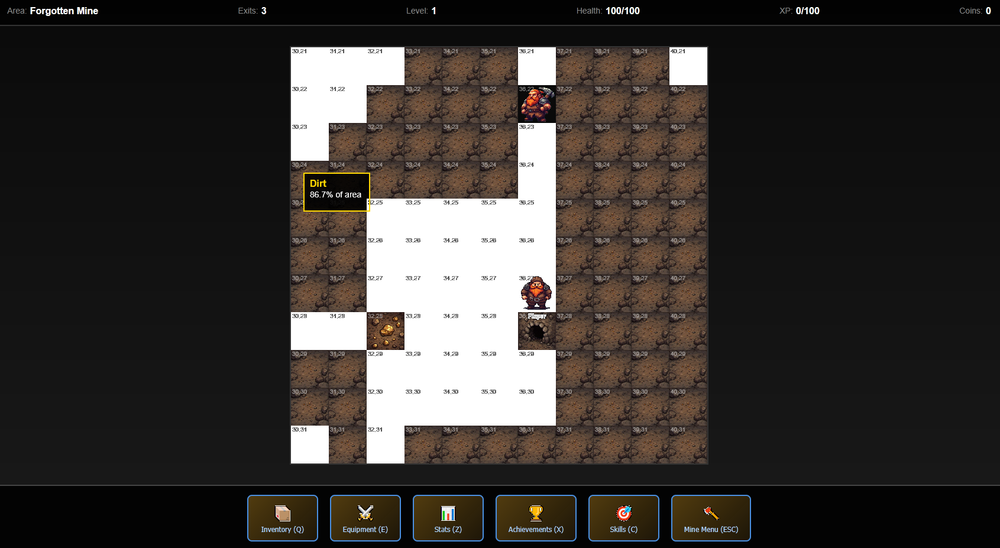

# Mine Quest


A 2D grid-based exploration and mining game with no predefined quests. Players explore procedurally generated underground worlds, mine resources, battle enemies, and create their own goals in a sandbox environment.

## 🎮 Game Overview

Mine Quest is a browser-based game built with HTML5 Canvas and vanilla JavaScript. Players navigate through procedurally generated underground areas, mine various materials, collect resources, and battle enemies in a turn-based combat system. The game features multiple game modes, a fog of war system, and is optimized for various platforms including Steam Deck.



## 🌟 Features

### Core Gameplay
- **Procedural World Generation**: Explore randomly generated underground areas with unique layouts
- **Resource Mining**: Mine various materials including dirt, rock, crystals, gems, and precious metals
- **Equipment System**: Equip helmets, armor, boots, pickaxes, gloves, and amulets to enhance your abilities
- **Turn-Based Combat**: Battle enemies with a strategic combat system based on equipment and stats
- **Progression System**: Level up your character to increase health and stats
- **Fog of War**: Discover the world as you explore the caves

### Game Modes
- **Standard Mode**: Unlimited exploration with procedurally generated areas
- **Custom Mode**: Play in player-created or community-shared custom areas
- **Gauntlet Mode**: Time-based challenge where you must find the exit within 10 minutes

### Technical Features
- **Cross-Platform Support**: Optimized for desktop, mobile, and Steam Deck
- **Responsive Design**: Adapts to different screen sizes and aspect ratios
- **Touch Controls**: On-screen D-pad and action buttons for mobile devices
- **Save System**: Multiple save slots with auto-save functionality
- **Cloud Integration**: Steam Cloud save support

## 🎯 How to Play

1. **Movement**: Use WASD keys or the on-screen D-pad to move your character
2. **Mining**: Press Spacebar or tap on blocks to mine resources
3. **Inventory**: Press 'I' to open your inventory and manage collected items
4. **Equipment**: Press 'E' to equip gear and enhance your abilities
5. **Combat**: Approach enemies and engage in turn-based battles
6. **Exploration**: Discover new areas by finding and entering doors

## 🛠️ Installation

### Prerequisites
- A modern web browser (Chrome, Firefox, Edge, Safari)
- Local web server (for development)

### Quick Start

1. Clone the repository:
   ```bash
   git clone https://github.com/stevebuscemi1/mine_quest
   ```

2. Navigate to the project directory:
   ```bash
   cd mine-quest
   ```

3. Start a local web server:

OPTION 1:
   ```bash
   # Using Python 3
   python -m http.server 8000
   
   # Using Node.js (if you have http-server installed)
   npx http-server
   ```
OPTION 2:
Use the batch file `start_mine_quest.bat` in the root directory of the project.

4. Open your browser and go to `http://localhost:8000`

## 🏗️ Project Structure

```
mine-quest/
├── index.html              # Main HTML file
├── css/
│   ├── styles.css          # Main styling rules
│   └── startpage.css       # Start page specific styles
├── js/
│   ├── main.js             # Entry point
│   ├── constants/
│   │   └── GameConstants.js # Game constants and definitions
│   ├── core/
│   │   ├── Game.js         # Main game loop and rendering
│   │   ├── Player.js       # Player class and mechanics
│   │   ├── Enemy.js        # Enemy class and AI
│   │   ├── Area.js         # Area generation and management
│   │   └── FogOfWar.js     # Fog of war system
│   ├── systems/
│   │   ├── Inventory.js    # Inventory management
│   │   ├── Equipment.js    # Equipment system
│   │   ├── Merchant.js     # Merchant logic
│   │   ├── Timer.js        # Timer system for gauntlet mode
│   │   ├── CustomArea.js   # Custom area creation and sharing
│   │   ├── SaveSystem.js   # Save/load functionality
│   │   └── AudioSystem.js  # Audio management
│   ├── ui/
│   │   ├── UI.js           # User interface management
│   │   ├── StartPage.js    # Start page implementation
│   │   ├── ResponsiveDesign.js # Responsive layout handling
│   │   ├── TouchControls.js # Touch controls for mobile
│   │   └── SaveLoadUI.js   # Save/load UI components
│   ├── modes/
│   │   ├── StandardMode.js # Standard game mode
│   │   ├── CustomMode.js   # Custom area game mode
│   │   └── GauntletMode.js # Time-based challenge mode
│   └── utils/
│       └── Utils.js        # Utility functions
└── assets/
    ├── images/             # Image assets
    ├── icons/              # Favicon and app icons
    └── customareas/        # Custom area data
```

## 🎨 Game Assets

The game features a variety of visual assets including:
- Cell textures for different materials (dirt, rock, gold, gems, etc.)
- Character sprites for player and enemies
- UI elements for inventory, equipment, and dialogs
- Animated backgrounds for the start page
- Touch controls for mobile devices

## 🔧 Development

### Technologies Used
- **Frontend**: HTML5, CSS3, JavaScript (ES6 modules)
- **Graphics**: HTML5 Canvas for rendering
- **Storage**: LocalStorage for save game persistence
- **Audio**: Web Audio API for sound effects

### Code Organization
The game follows a modular architecture with clear separation of concerns:
- **Core Modules**: Handle game mechanics, player, enemies, and world generation
- **System Modules**: Manage specific game systems like inventory, equipment, and merchants
- **UI Modules**: Handle user interface components and interactions
- **Mode Modules**: Implement different game modes (standard, custom, gauntlet)
- **Utility Modules**: Provide helper functions and utilities

### Contributing
1. Fork the repository
2. Create a feature branch (`git checkout -b feature/AmazingFeature`)
3. Commit your changes (`git commit -m 'Add some AmazingFeature'`)
4. Push to the branch (`git push origin feature/AmazingFeature`)
5. Open a pull request

## 🎮 Controls

### Keyboard
- **WASD**: Movement
- **Space**: Mine/Interact
- **I**: Open Inventory
- **E**: Open Equipment
- **F**: Interact
- **ESC**: Menu/Close

### Gamepad
- **D-Pad**: Movement
- **A Button**: Interact
- **B Button**: Menu
- **X Button**: Inventory
- **Y Button**: Equipment

### Touch
- **On-screen D-pad**: Movement
- **Tap**: Move/Interact
- **Long Press**: Context menu

## 📱 Platform Support

- **Desktop**: Windows, macOS, Linux with modern browsers
- **Mobile**: iOS Safari, Android Chrome
- **Steam Deck**: Optimized for Steam Deck controls and performance

## 📄 License

This project is licensed under the CC BY-NC-SA 4.0 License - see the [LICENSE](LICENSE) file for details.

## 🙏 Acknowledgments

- Inspired by classic dungeon crawler and mining games
- Built with vanilla JavaScript for maximum compatibility
- Designed with accessibility and cross-platform support in mind

## 🚀 Future Enhancements

- Multiplayer support
- Steam Workshop integration for custom areas
- Additional game modes
- Enhanced graphics and animations
- More diverse enemy types and bosses
- Advanced crafting system

---

*Enjoy your underground adventure in Mine Quest!*

#
